# aks-how2

This repository is intended to provide information for the operation of a Kubernetes cluster including deployment within Azure.

# Contents

- [aks-how2](#aks-how2)
- [Contents](#contents)
- [Microsoft Azure Services](#microsoft-azure-services)
  - [Active Directory Application Registry](#active-directory-application-registry)
- [Definitions](#definitions)
  - [Infrastructure Services](#infrastructure-services)
  - [Application Services](#application-services)
  - [Namespaces](#namespaces)
- [General Security Requirements for SPA applications](#general-security-requirements-for-spa-applications)
  - [id_token vs access_token](#id_token-vs-access_token)
    - [`id_token`](#id_token)
    - [`access_token`](#access_token)
  - [Protect Access to Applications](#protect-access-to-applications)
  - [Workflow of OAuth2-Proxy and MSAL in SPAs](#workflow-of-oauth2-proxy-and-msal-in-spas)
  - [Workflow of Auth2-Proxy and MSAL in Backend/Daemons](#workflow-of-auth2-proxy-and-msal-in-backenddaemons)
  - [Workflow of OAuth2 proxy and MSAL for MS Teams integration of a SPA](#workflow-of-oauth2-proxy-and-msal-for-ms-teams-integration-of-a-spa)
  - [Protection towards SharePoint and other Microsoft Resources](#protection-towards-sharepoint-and-other-microsoft-resources)
- [Setup Cluster](#setup-cluster)
  - [Prerequisites](#prerequisites)
    - [Install kubectl, az and Helm](#install-kubectl-az-and-helm)
  - [1. Create AKS Cluster](#1-create-aks-cluster)
  - [2. Connect CLI to the k8s Cluster](#2-connect-cli-to-the-k8s-cluster)
  - [3. Create Public IP Address](#3-create-public-ip-address)
  - [4. Bind IP Address to Domain Name](#4-bind-ip-address-to-domain-name)
  - [5. Create Namespaces](#5-create-namespaces)
  - [6. Attach Azure Container Registry (ACR)](#6-attach-azure-container-registry-acr)
  - [7. Setup Ingress Nginx](#7-setup-ingress-nginx)
    - [7.1. Get a PVC](#71-get-a-pvc)
    - [7.2. Create Ingress Nginx Controller](#72-create-ingress-nginx-controller)
    - [7.3. Copy Lua plugins](#73-copy-lua-plugins)
  - [8. Install cert-manager](#8-install-cert-manager)
    - [8.1. Use cert-manager](#81-use-cert-manager)
  - [9. Install OAuth2-Proxy](#9-install-oauth2-proxy)
    - [9.1. Peculiarities](#91-peculiarities)
    - [9.2. Install redis](#92-install-redis)
    - [9.3. Install OAuth2-Proxy instances](#93-install-oauth2-proxy-instances)
    - [9.4. Require authentication for an application](#94-require-authentication-for-an-application)
- [Deployment of Applications](#deployment-of-applications)
  - [Basic information about Pipelines in Azure DevOps](#basic-information-about-pipelines-in-azure-devops)
  - [Structure of CI Pipelines](#structure-of-ci-pipelines)
  - [Structure of CD Pipelines](#structure-of-cd-pipelines)
  - [How to deploy a Code Change to an existing Application?](#how-to-deploy-a-code-change-to-an-existing-application)
  - [How to deploy a completely new Application to the Kubernetes Cluster?](#how-to-deploy-a-completely-new-application-to-the-kubernetes-cluster)
    - [Prerequisites](#prerequisites-1)
    - [1. Dockerize your application](#1-dockerize-your-application)
    - [2. Create a Helm Chart](#2-create-a-helm-chart)
    - [3. Create a CI Pipeline](#3-create-a-ci-pipeline)
    - [4. Create a CD Pipeline](#4-create-a-cd-pipeline)

# Microsoft Azure Services

We use the following Microsoft Azure features to run a Kubernetes cluster:

* Azure DevOps is used for project management (Azure Boards), Git repositories (Azure Repos), and continuous integration/continuous deployment (Azure Pipelines).
* Active Directory is used for [SSO feature](https://en.wikipedia.org/wiki/Single_sign-on) through application registry and client secrets.
* Azure Container Registry is used to store Docker images and Helm charts.
* Azure Kubernetes Cluster is used to provide our own Kubernetes cluster.
* Azure API Management is used to centralize all REST API endpoints that are accessed (e.g., the [Graph API](https://docs.microsoft.com/en-us/graph/use-the-api) to access SharePoint).

## Active Directory Application Registry

It is often advantageous to have two tenants (productive and test tenant). With a registration in the [Azure Portal](https://portal.azure.com), the Microsoft Identity Platform can provide authentication (OpenID-Connect) and authorisation (OAuth2) for our applications. This is often advantageous exactly when the organisation is already fully integrated into the Microsoft Azure world. If not, other identity providers can of course also be used here, such as [Auth0](https://auth0.com/).

In the case of the Microsoft Identity Platform, it only performs identity and access management (IAM) for registered applications. Whether it is a client application like a web or mobile app, or it is a web API that backs a client app, registering it establishes a trust relationship between your application and the identity provider, the Microsoft identity platform.
If you visit the App registration in the [Azure Portal](https://portal.azure.com), the most important parts for now are 

* *client ID* or `client_id`
* *tenant ID* or `tenant_id`
* *redirect URI* or `redirect_uri` and 
* *client secret* or `client_secret`

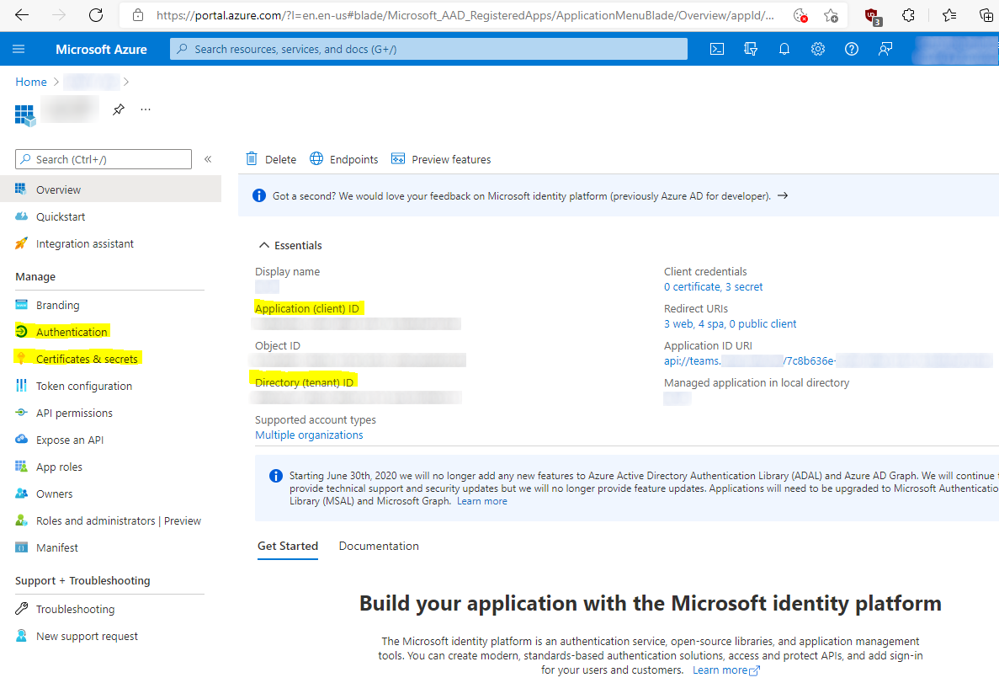

The *client ID* or `client_id` is used to identify the application registry in the Active Directory for authentication or authorization purposes. The *tenant ID* or `tenant_id` is used to identify the organization where the app registration takes place. Whenever some application implements authentication or authorization (e.g. using [MSAL](https://www.npmjs.com/package/@azure/msal-browser) to get access to an `access_token`) or the [OAuth2-Proxy](https://github.com/oauth2-proxy/oauth2-proxy) for authentication), you need to provide both entities.

The *client secret* or `client_secret` is used to obtain additional tokens for authentication or authorization. For example:

1. The OAuth2-Proxy requires one for its authentication flow
2. Daemons, see [Client Credentials Flow](https://docs.microsoft.com/en-us/azure/active-directory/develop/v2-oauth2-client-creds-grant-flow)
3. The Azure API Management requires one to support in the [OBO-Flow](https://docs.microsoft.com/en-us/azure/active-directory/develop/v2-oauth2-on-behalf-of-flow) when you want to deploy applications to Microsoft Teams

The `redirect_uri` or *redirect URI* is used to tell Microsoft that the URL is allowed to retrieve the `id_token` or `access_token` after a successful authentication of the user. This is a security mechanism which is defined in the respective [OAuth2/OIDC protocol](https://www.oauth.com/oauth2-servers/redirect-uris/). **Please note:** Whenever the URL of your application will change (e.g. from x.organisation.de to y.organisation.de), you also need to adapt the `redirect_uri` in the application registration in Azure.

# Definitions

## Infrastructure Services

We consider infrastructure services to be applications that are dedicated solely to the operation of the Kubernetes cluster and the applications within it. For example, an Ingress Nginx Controller is an infrastructure service if it receives incoming traffic and forwards it to the applications within the cluster. It has no direct benefit to the user and provides no business logic related function.

## Application Services

We consider application services within the cluster to be those that provide a service to the end user with a direct benefit. This is, for example, a web application that offers a direct benefit to the user.

## Namespaces

The k8s cluster contains three important namespaces: 

1. infrastructure
2. development
3. production

The `infrastructure` namespace contains all infrastructure services like the Ingress Nginx Controller or the OAuth2-Proxy instances.

The `development` namespace contains all application services that are used as a test system. Typically, these applications reflect the test branch.

The `production` namespace contains all productive application services where the users will typically be working on. These applications reflect the main branch.

# General Security Requirements for SPA applications

## id_token vs access_token

First of all, it is important to understand the difference between `id_token` and `access_token`, as both are [JSON Web Token (JWT)](https://datatracker.ietf.org/doc/html/rfc7519) but are issued for different purposes. Both token types are part of authentication or authorization flows in the [OpenID Connect](https://openid.net/connect/) or [OAuth2](https://oauth.net/2/) protocol. Both of them can be issued by Microsoft.

### `id_token`

An [`id_token`](https://openid.net/specs/openid-connect-core-1_0.html#IDToken) is used for [authentication](https://en.wikipedia.org/wiki/Authentication) and part of the [OpenID Connect protocol](https://docs.microsoft.com/en-us/azure/active-directory/develop/v2-protocols-oidc). Information in an `id_token` allows the client (e.g., the OAuth2-Proxy) to verify that a user is who they claim to be. Thus, `id_tokens` are not used for authorization purposes. For example, you cannot use an `id_token` to access [Microsoft's Graph API](https://docs.microsoft.com/de-de/graph/use-the-api) because it is a resource that requires an `access_token`.

This is a typical base64 encoded `id_token` issued by Microsoft in the format of a JWT:

```base64
eyJ0eXAiOiJKV1QiLCJhbGciOiJSUzI1NiIsImtpZCI6Imwzc1EtNTBjQ0g0eEJWWkxIVEd3blNSNzY4MCJ9.eyJhdWQiOiI3YzhiNjM2ZS0yMjk5LTRmMGQtOTE2Ny1iMWI4OTJhZjEwM2QiLCJpc3MiOiJodHRwczovL2xvZ2luLm1pY3Jvc29mdG9ubGluZS5jb20veHh4L3YyLjAiLCJpYXQiOjE2Mzg3MDk2MTQsIm5iZiI6MTYzODcwOTYxNCwiZXhwIjoxNjM4NzEzNTE0LCJlbWFpbCI6Inh4eEB4eHguZGUiLCJmYW1pbHlfbmFtZSI6Inh4eCIsImdpdmVuX25hbWUiOiJ4eHgiLCJuYW1lIjoieHh4LCB4eHgiLCJub25jZSI6ImY3MTEyZGQwLWQyYzMtNGI3NS04ZjkzLWY0YTViNTUwMTE5NiIsIm9pZCI6Ijk3NGY1Njc0LTgyMTYtNGVkNy1hOGIxLWZlMmVmMDBmOTY2MyIsInByZWZlcnJlZF91c2VybmFtZSI6Inh4eEB4eHguZGUiLCJyaCI6IjAuQVRFQXA2eUZTUzNiV1V1aEZleXhrX0JqRVc1amkzeVpJZzFQa1dleHVKS3ZFRDB4QUdNLiIsInN1YiI6InV3M2N0eEFuS3NIdE9HZWkxN3VjR2pueHllSTE3Umh4MDR0eEJVX2EwaG8iLCJ0aWQiOiI0OTg1YWNhNy1kYjJkLTRiNTktYTExNS1lY2IxOTNmMDYzMTEiLCJ1cG4iOiJ4eHhAeHh4LmRlIiwidXRpIjoibDMwQkVDZlpoVUdocjdDRjlwdzhBQSIsInZlciI6IjIuMCJ9.b2BqBZFeHWiARZXCEtQ9HwHUuV0lelBp1hfYe3lfy20RHbl59zOpu4yWdoOvxJXCeePyCe7OQQSWyFhTG3BPjGmrfUEJ2vQyrAobCHnkrf4spGeWk4gaDLLWeEEG5TVv0pKPkkBRGX6SSldR538kKF-I_1lgMRvQoQwf3t2pXKfPT6Pug2FcYfOzcxM6L8lYw5Jd0-ZrRC16cTzEAqFFjV2ONMwcD2bz0BkgFRmGD6NuhUc5zmLcYxXODnHSKGcTmd1cQwPDY3hfv70E-NGAIBtkuf-TlAMrweMksclCsvlcrP_bMRAF0mQGEeY37HBSnqzOy4sjGCtY4IFIpJjnhQ
```

Decoding it with [jwt.io](jwt.io), you can see its content:

```json
{
  "typ": "JWT",
  "alg": "RS256",
  "kid": "l3sQ-50cCH4xBVZLHTGwnSR7680"
}.
{
  "aud": "7c8b636e-2299-4f0d-9167-b1b892af103d",
  "iss": "https://login.microsoftonline.com/xxx/v2.0",
  "iat": 1638709614,
  "nbf": 1638709614,
  "exp": 1638713514,
  "email": "xxx@xxx.de",
  "family_name": "xxx",
  "given_name": "xxx",
  "name": "xxx, xxx",
  "nonce": "f7112dd0-d2c3-4b75-8f93-f4a5b5501196",
  "oid": "974f5674-8216-4ed7-a8b1-fe2ef00f9663",
  "preferred_username": "xxx@xxx.de",
  "rh": "0.ATEAp6yFSS3bWUuhFeyxk_BjEW5ji3yZIg1PkWexuJKvED0xAGM.",
  "sub": "uw3ctxAnKsHtOGei17ucGjnxyeI17Rhx04txBU_a0ho",
  "tid": "4985aca7-db2d-4b59-a115-ecb193f06311",
  "upn": "xxx@xxx.de",
  "uti": "l30BECfZhUGhr7CF9pw8AA",
  "ver": "2.0"
}
.
<some base64 encoded signature>
```

### `access_token`

An [`access_token`](https://oauth.net/2/access-tokens/) is used to securely call protected web APIs, for example, Microsoft's Graph API. Unlike `id_tokens`, they do not necessarily need to be in any particular format. In the case of [Microsoft](https://docs.microsoft.com/en-us/azure/active-directory/develop/access-tokens), they are also issued in the format of a JWT. `access_tokens` are issued by Microsoft with scopes that define the actions you can perform with it.

An `access_token` issued by Microsoft is, like the `id_token`, also a JWT, but in contrast it is signed with completely different keys and contains a completely different payload. Here you can also see the valid range (`scp`) for which the `access_token` can be used:

```json
{
  "typ": "JWT",
  "nonce": "Y2j-TriGaN7A2aiyzAFS0C1zaBHJTNxvDyMjUznqSac",
  "alg": "RS256",
  "x5t": "l3sQ-50cCH4xBVZLHTGwnSR7680",
  "kid": "l3sQ-50cCH4xBVZLHTGwnSR7680"
}.
{
  "aud": "00000003-0000-0000-c000-000000000000",
  "iss": "https://sts.windows.net/xxx/",
  "iat": 1638712615,
  "nbf": 1638712615,
  "exp": 1638717986,
  "acct": 0,
  "acr": "1",
  "aio": "AUQAu/8TAAAALU38WwdR9noMnYNkeaXI1jRM8PjBmLUBR5LKTPzYBigaWH7GIAXXPxoNU9XO2gSgUzBMW+dDbaB9/pCXTtf5/A==",
  "amr": [
    "pwd",
    "rsa",
    "mfa"
  ],
  "app_displayname": "<application name>",
  "appid": "<application id from azure registry>",
  "appidacr": "0",
  "deviceid": "<some device id>",
  "family_name": "xxx",
  "given_name": "xxx",
  "idtyp": "user",
  "in_corp": "true",
  "ipaddr": "<some ip address>",
  "name": "xxx, xxx",
  "oid": "<unique principal id>",
  "onprem_sid": "S-1-5-21-3448204099-1577104804-313934379-28843",
  "platf": "3",
  "puid": "100320009DCA41B4",
  "rh": "0.ATEAp6yFSS3bWUuhFeyxk_BjEW5ji3yZIg1PkWexuJKvED0xAGM.",
  "scp": "email Group.Read.All openid profile Sites.Manage.All Sites.Read.All Sites.ReadWrite.All User.Read User.ReadBasic.All User.ReadWrite",
  "signin_state": [
    "dvc_mngd",
    "dvc_dmjd",
    "kmsi"
  ],
  "sub": "M8KTE3C48dSs-DdNvNmKP5EzSUA4W1KjTih6cqP44t4",
  "tenant_region_scope": "EU",
  "tid": "<tenant id>",
  "unique_name": "xxx.xxx@xxx.de",
  "upn": "xxx.xxx@xxx.de",
  "uti": "1p-tO-sj2E2o3-0TETZxAQ",
  "ver": "1.0",
  "wids": [
    "b79fbf4d-3ef9-4689-8143-76b194e85509"
  ],
  "xms_st": {
    "sub": "uw3ctxAnKsHtOGei17ucGjnxyeI17Rhx04txBU_a0ho"
  },
  "xms_tcdt": 1538049412
}.
<some base64 signature>
```

## Protect Access to Applications

If [single-page applications (SPAs)](https://en.wikipedia.org/wiki/Single-page_application) contain business logic in the form of code and these may only be delivered if the user is authorised, SPAs require increased security requirements here. For this purpose, we use the [OAuth2-Proxy](https://github.com/oauth2-proxy/oauth2-proxy), which implements the [OpenID Connect protocol](https://docs.microsoft.com/en-us/azure/active-directory/develop/v2-protocols-oidc) and grants access to the applications only to authenticated users. So, Microsoft acts as an [identity provider](https://docs.microsoft.com/en-us/azure/active-directory/external-identities/identity-providers). Another benefit is [SSO (Single-Sign-On)](https://en.wikipedia.org/wiki/Single_sign-on) which comes out of the box when using the OAuth2-Proxy.

The following figure shows how an [SPA](https://en.wikipedia.org/wiki/Single-page_application) is accessed and protected via the OAuth2-Proxy.

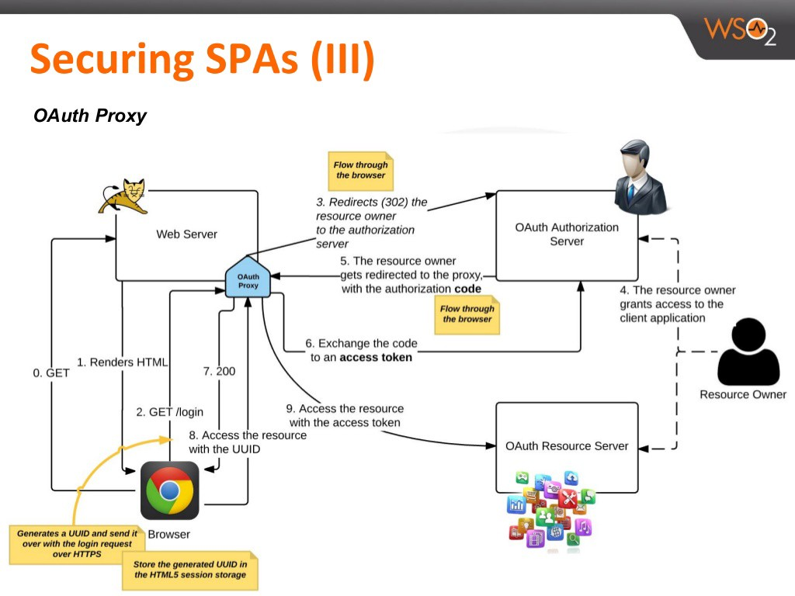

[Source](https://thilinamad.medium.com/oauth2-proxy-for-single-page-applications-8f01fd5fdd52)

## Workflow of OAuth2-Proxy and MSAL in SPAs

The OAuth2 proxy alone is not sufficient for an SPA application to also give it access to the `id_token` (e.g. to display the user name) or `access_token` (e.g. to get access to SharePoint resources). Here we use the [MSAL library](https://www.npmjs.com/package/@azure/msal-browser) for the following reasons to trigger an authorisation flow in the background again:

1. The OAuth2-Proxy is solely responsible for authenticating the user and routing to the application. This means that the OpenID Connect protocol is performed here without scope (e.g. Graph API). This means that only a signed [`id_token`](https://docs.microsoft.com/de-de/azure/active-directory/develop/id-tokens) is returned from Microsoft, which is used for authentication, but cannot be used to access resources like the Graph API. Furthermore, the `id_token` is not made available to any application, since it is stored encrypted in the Redis database in the cluster (see installation in the later chapter) and referenced via an [encrypted ticket](https://oauth2-proxy.github.io/oauth2-proxy/docs/configuration/session_storage/#redis-storage) in the cookie. It is therefore reserved exclusively for SSO and the OAuth2-Proxy. An SPA application cannot access the cookie ticket because the cookie is not accessible to JavaScript because of policy settings.

2. Some SPAs may require additional authorization, e.g. to the resources like SharePoint. Thus, they need to implement its own authorization workflow to get an [`access_token`](https://docs.microsoft.com/en-us/azure/active-directory/develop/access-tokens). We use the official [MSAL library](https://www.npmjs.com/package/@azure/msal-browser) from Microsoft for SPA applications to run the authorization flow in the background. Since the user is already logged in via the OAuth2-Proxy, we can take advantage of SSO and run the authorization flow in the background without requiring the user to log in again.

3. Reasons for development: Since a developer does not run an OAuth2 proxy locally, but he also wants to communicate with SharePoint in his development environment, a separate authorization workflow must be performed. Unlike described in 2., here the authorization workflow is not performed in the background, but the developer is redirected to Microsoft and asked to login. This means that a complete authorization workflow is performed.

4. Expiration: `access_tokens` have a fixed lifetime of about one hour. After an `access_token` has expired, a fresh one must be requested from Microsoft via an specific authorization flow. This is also done via the MSAL library.

## Workflow of Auth2-Proxy and MSAL in Backend/Daemons

Not only SPAs need to be protected from unauthorised access by the OAuth2-Proxy, but also backend services that provide APIs via an HTTP endpoint. Typically, the HTTP request is made with an [Authorization header](https://developer.mozilla.org/en-US/docs/Web/HTTP/Headers/Authorization) and a [Bearer token](https://datatracker.ietf.org/doc/html/rfc6750) which is an HTTP authentication scheme. Unlike the accessing the Graph API, in this example the Bearer token is not an `access_token` but an `id_token`. This difference is important to consider because the `id_token` has a valid signature issued by Microsoft which can be validated by the OAuth2-Proxy. It compares the signature with the public keys mentioned in the JWT header:

```json
{
  "typ": "JWT",
  "alg": "RS256",
  "kid": "l3sQ-50cCH4xBVZLHTGwnSR7680"
}.
{
  "aud": "7c8b636e-2299-4f0d-9167-b1b892af103d",
  "iss": "https://login.microsoftonline.com/xxx/v2.0",
  "iat": 1638709614,
  "nbf": 1638709614,
  "exp": 1638713514,
  "email": "xxx.xxx@xxx.de",
  "family_name": "xxx",
  "given_name": "xxx",
  "name": "xxx, xxx",
  "nonce": "f7112dd0-d2c3-4b75-8f93-f4a5b5501196",
  "oid": "<unique principal id>",
  "preferred_username": "xxx.xxx@xxx.de",
  "rh": "0.ATEAp6yFSS3bWUuhFeyxk_BjEW5ji3yZIg1PkWexuJKvED0xAGM.",
  "sub": "uw3ctxAnKsHtOGei17ucGjnxyeI17Rhx04txBU_a0ho",
  "tid": "<tenant id>",
  "upn": "xxx.xxxx@xxx.de",
  "uti": "l30BECfZhUGhr7CF9pw8AA",
  "ver": "2.0"
}.<base64 encoded signature>
```

Only if the signature is valid and the `id_token` has not expired, access to backend services may be granted.

However, the backend service itself needs to access data from SharePoint. Thus, it will execute itself an authentication flow using the [MSAL library](https://www.npmjs.com/package/@azure/msal-browser) to get an `access_token`. Unlike in the SPA's scenario, it will request an `access_token` withouth user interaction using a [specific authorization flow for daemon apps](https://docs.microsoft.com/en-us/azure/active-directory/develop/scenario-daemon-acquire-token?tabs=dotnet). 

## Workflow of OAuth2 proxy and MSAL for MS Teams integration of a SPA

In addition to simply accessing SPAs via a URL, it can also be advantageous in some organisations to integrate the SPA as a Microsoft Teams application. This can be done by simply defining a [manifest](https://docs.microsoft.com/en-us/microsoftteams/platform/resources/schema/manifest-schema) within MS Teams, where only the URL of the SPA is called in the background. However, special attention should again be paid to the authorisation flow. There are two requirements to consider: 

1. Since the user must already be successfully logged in to MS Teams with his company account in order to use an MS Teams application, he should not have to do this a second time with the SPA (single sing-on).
2. Since the SPA is also called up in the background by MS Teams via a URL, the same security requirements apply here as when the SPA is called up without MS Teams integration. This means in particular that the JavaScript code may only be delivered as soon as the user is authorised to do so.
3. Since the application runs within MS Teams and is only allowed to specify a valid URL through a [manifest](https://docs.microsoft.com/en-us/microsoftteams/platform/resources/schema/manifest-schema), redirection to Microsoft's login page through MS Teams is prohibited. However, this is in contradiction to the OAuth2/OpenID-Connect protocol, which forwards to the identity provider in order to get back to the website, in our case the SPA, after authentication with a valid id_token/access_token. 

Therefore, there must be a piece of code that is publicly accessible on the web, but does not leak any business logic and is solely responsible for authentication. In this case, the teamsauthhelper provides this piece of code. 

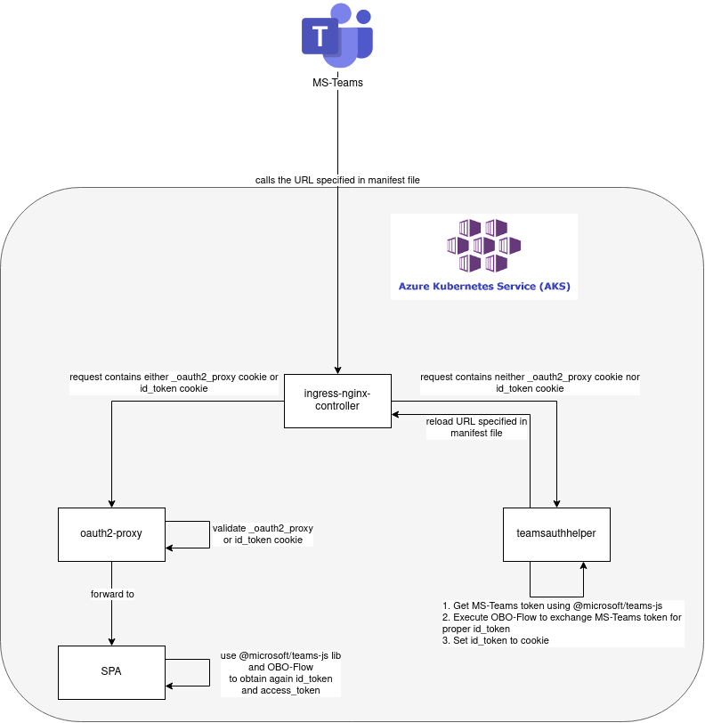

When a request is made for the first time from MS Teams to the SPA application, the nginx controller (in the k8s cluster) recognizes that no authentication cookies have been given and the user is trying to call the SPA for the first time. This behavior is defined in a self-written Lua script in the nginx-controller (``/etc/nginx/lua/plugins/transform/main.lua``) which you can have a look at in the folder named ingress. So it forwards the request directly to teamsauthhelper. This fetches an ``access_token`` from MS Teams using the official ``@microsoft/teams-js`` library. However, this token is not valid for the OAuth2-Proxy because it was not issued by the expected issuer and furthermore, the OAuth2-Proxy requires an `id_token`. Moreover, the token from MS Teams [cannot be used](https://docs.microsoft.com/en-us/microsoftteams/platform/tabs/how-to/authentication/auth-aad-sso#get-an-access-token-with-graph-permissions) to access the Microsoft Graph API. However, this is mandatory for some SPAs. Therefore, the MS Teams access_token is exchanged in the [OBO flow](https://docs.microsoft.com/en-us/azure/active-directory/develop/v2-oauth2-on-behalf-of-flow) by a token, which on the one hand is understood by the OAuth2-Proxy and on the other hand can be used within the SPA (e.g. to acquire a proper access_token).

The OBO flow is executed using the Azure API Management, since the OBO flow always requires a ``client_secret`` as well. However, the use of a ``client_secret`` conflicts with the requirement that the teamsauthhelper can be called without authentication. This is because if the ``client_secret`` were used in teamsauthhelper, anyone calling teamsauthhelper could extract the ``client_secret`` from the code, since the code is executed in the user's browser. Thus, the ``client_secret`` is appended to the request towards Microsoft exactly when the MS Teams ``access_token`` provided is valid. This means that the user can only execute the OBO flow if he has already received a valid ``access_token`` from MS Teams.

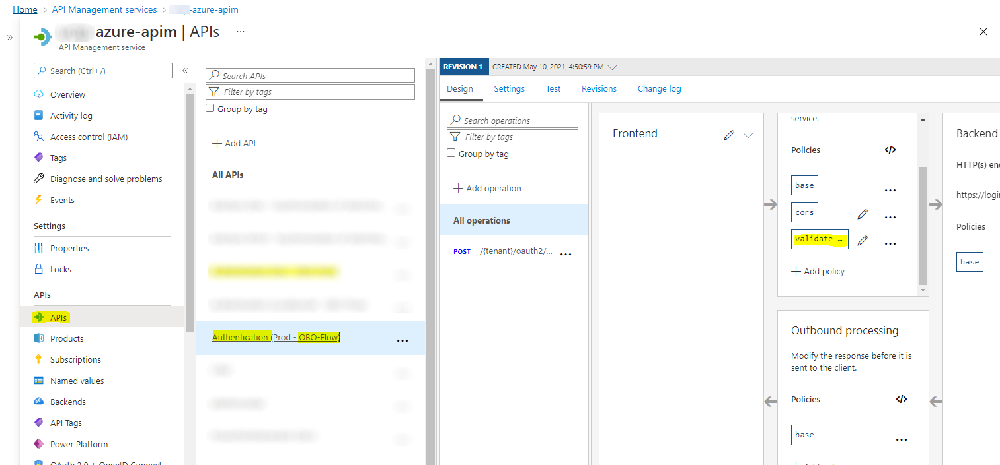

This part of the APIM rule describes that the OBO flow can only be executed if a valid MS Teams ``access_token`` is provided.

```XML
<validate-jwt 
    header-name="Authorization" 
    failed-validation-httpcode="401" 
    failed-validation-error-message="Unauthorized. Access token is missing or invalid." require-expiration-time="true" 
    require-signed-tokens="true">
            <openid-config 
              url="https://login.microsoftonline.com/<tenant>/v2.0/.well-known/openid-configuration" />
</validate-jwt>
```

Once the teamsauthhelper has acquired an ``id_token`` valid for the OAuth2-PRoxy and SPA, it creates a respective cookie named ``id_token`` and stores the ``id_token`` there. This is because [HTTP headers cannot be specified in an HTTP redirect](https://stackoverflow.com/questions/34671199/adding-custom-header-in-http-before-redirect). So the connection must be made stateful via cookies. You may consider additional protection like HttpOnly.

With the new redirect to the SPA's URL the cookie is now sent, which contains the valid ``id_token``. The nginx controller recognizes that the cookie is set and forwards the request to the OAuth2-Proxy so that the cookie and thus the ``id_token`` can be checked for validity. Since according to OBO Flow the ``id_token`` is now valid and could be validated, the SPA is called.

Now the SPA re-executes the entire authentication flow that teamsauthhelper has already done in advance. There are two reasons for this:

1. The ``id_token`` cookie is not readable by JavaScript applications due to security measures ([HttpOnly](https://developer.mozilla.org/en-US/docs/Web/HTTP/Cookies#restrict_access_to_cookies)) and thus, cannot be accessed by the SPA.
2. Each token, whether ``id_token`` or ``access_token``, has an expiration date. This means that after a certain point in time, a new token must be obtained from Microsoft to ensure continuous access to the Graph API. This means that the SPA must also be able to perform exactly the authentication flow from teamsauthhelper.

Thus, the SPA also uses the ``@microsoft/teams-js`` library to retrieve the MS Teams ``access_token`` on the one hand to then perform the OBO flow using the APIM to get a valid ``id_token`` and ``access_token`` to access the Microsoft Graph API. The SPA can become aware that it is currently being called in the environment and MS Teams (via MSAL library or the called URL) and can therefore perform different authorisation flows.

## Protection towards SharePoint and other Microsoft Resources

Obtaining an `access_token` using the [MSAL library](https://www.npmjs.com/package/@azure/msal-browser) to get access, for example, to the Graph API requires scopes. Using the [Graph API](https://docs.microsoft.com/en-us/graph/use-the-api) we can, for example, feed data into lists from SharePoint. The allowed actions are defined by the scopes, which are specified in the authorization flow to obtain an `access_token`. 

In the case of a SPA, for example, we can define the scope like in the following example:

```typescript
const authentication = {
	// MS Graph: MSAL ids
	clientId: "<your client id from Azure app registration>",
	tenantId: "<your tenant>",
	authority: "https://login.microsoftonline.com/",
	scopes: [
		"User.Read",
		"User.ReadBasic.All",
		"User.ReadWrite",
		"Sites.Manage.All"
	]
};
```

The allowed scopes are defined in the app registration in the Azure Active Directory. Specific scopes need to be granted by the organisation's administrator in order to use them in the app registration.

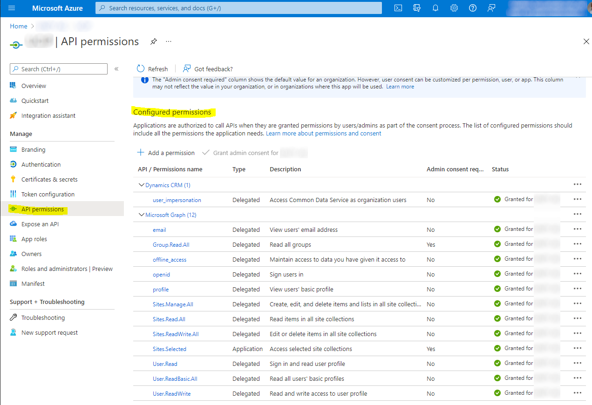

# Setup Cluster

In this section we describe how to setup your own AKS (Azure Kubernetes Cluster) that is capable of operating applications.

## Prerequisites

In general, the Kubernetes cluster should be built in such a way that a developer does not have to interact directly with the cluster (e.g. using kubectl), but can simply use CI/CD pipelines to deploy his applications to the cluster. Fortunately, Azure DevOps offers Azure Pipelines fully integrated, so that CI/CD pipelines can be created, edited and triggered via a simple GUI without having to access the cluster directly.

However, since we are building a completely new cluster here, including infrastructure applications, we are working directly on the cluster. In addition, previous knowledge of Kubernetes is required, in particular the concepts of [Pods](https://kubernetes.io/de/docs/concepts/workloads/pods/), [Deployments](https://kubernetes.io/docs/concepts/workloads/controllers/deployment/), [Service](https://kubernetes.io/docs/concepts/services-networking/service/), [Ingress](https://kubernetes.io/docs/concepts/services-networking/ingress/) and the cli [kubectl](https://kubernetes.io/docs/reference/kubectl/overview/). You should be also familiar with [Helm](https://helm.sh/). Nevertheless, these are only the absolute basic requirements, of course, we encourage you to read the whole Kubernetes documentation.

### Install kubectl, az and Helm

 First, install [kubectl](https://docs.microsoft.com/en-us/cli/azure/install-azure-cli) to get access to the Kubernetes cluster through CLI. Connect to a existing cluster by following [this tutorial](https://docs.microsoft.com/de-de/azure/aks/quickstart-helm#connect-to-your-aks-cluster).

Furthermore, we use [Helm](https://helm.sh/docs/helm/helm_install/) to abstract from the Kubernetes YAML files and to simplify deployment. Helm provides a simple CLI to install or modify applications without touching individual Kubernetes YAML files.

## 1. Create AKS Cluster

Got to the [Azure Portal](portal.azure.com) and create a new ```resource``` via the Microsoft marketplace. Consider the different billing plans and pricing models.

## 2. Connect CLI to the k8s Cluster

Once you have created the k8s cluster, you are ready to connect to the cluster via CLI. Install ```kubectl``` and follow this [tutorial's section](https://docs.microsoft.com/de-de/azure/aks/quickstart-helm#connect-to-your-aks-cluster).

## 3. Create Public IP Address

Execute the following command to bound a public IP address to your cluster:

```
az network public-ip create --resource-group <resource-group-name-of-cluster-resources> --name <some-name> --sku Standard --allocation-method static`.
```

Be aware that there are costs involved after running the command, even if they are little for an IP address.

## 4. Bind IP Address to Domain Name

Go to the resource group of your recently created k8s cluster at [Azure Portal](portal.azure.com) and get the ip address that is bound to the cluster.

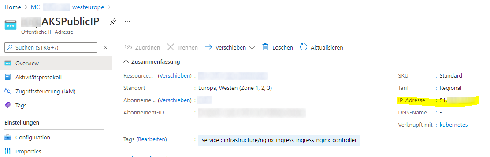

Consider to set proper DNS records for the IP address. Here we recommend setting a [wildcard DNS record](https://en.wikipedia.org/wiki/Wildcard_DNS_record). This has the advantage that any subdomains can be created within the Kubernetes cluster without having to manually create additional DNS records. Since all traffic (regardless of the subsequent application running in the cluster) converges on exactly one IP address, it can be decided within the cluster to which application the traffic will ultimately be routed.

## 5. Create Namespaces

Execute 

```
kubectl create namespace infrastructure

kubectl create namespace production

kubectl create namespace development
```

to create all namespaces. The infrastructure namespace will later contain all services needed to maintain the cluster itself (like authentication proxy, nginx, and so on). Production and development namespaces will contain application services only.

## 6. Attach Azure Container Registry (ACR)

To get access to the [Azure Container Registry](https://docs.microsoft.com/en-us/azure/aks/cluster-container-registry-integration?tabs=azure-cli#configure-acr-integration-for-existing-aks-clusters) in the cluster, execute

```
az aks update -n <cluster-name> -g <resource-group> --attach-acr <acr-name>
```

## 7. Setup Ingress Nginx

The [Ingress Nginx](https://kubernetes.github.io/ingress-nginx/) is an [Ingress controller](https://kubernetes.io/docs/concepts/services-networking/ingress/) for Kubernets using [Nginx](https://www.nginx.com/) as a reverse proxy and load balancer. Ingres exposes HTTP and HTTPS routes from outside the cluster to services within the cluster. Traffic routing is controlled by rules defined on the Ingress resource. For more details have a look at the [Kubernetes documentation](https://kubernetes.io/docs/concepts/services-networking/ingress/). All inbound traffic is handled by the Ingress Nginx controller.

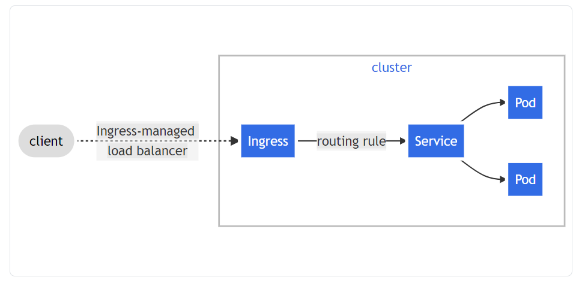

To install the controller, first add the Ingress Helm chart repository by executing

```
helm repo add ingress-nginx https://kubernetes.github.io/ingress-nginx
```

In this repository, there is a folder called ingress which contains two yaml-files. The `persistent-volume-lua.yaml` file is a [PVC](https://kubernetes.io/docs/concepts/storage/persistent-volumes/) (persistent volume claim) needed to persist data on disk. This is needed because the Ingress Nginx controller uses one of our self-written [Lua plugin](https://github.com/kubernetes/ingress-nginx/blob/main/rootfs/etc/nginx/lua/plugins/README.md) to properly handle the SPA application in MS-Teams (see ingress/plugins folder).\
The `values.yaml` file provides necessary configuration for the [Helm chart ingress-nginx/ingress-nginx](https://kubernetes.github.io/ingress-nginx/deploy/).

### 7.1. Get a PVC

First create the PVC by executing

```
kubectl apply -f persistent-volume-lua.yaml -n infrastructure
```

to create a PVC in the namespace infrastructure. *Attention:* Whenever a PVC is bound to a [Pod](https://kubernetes.io/de/docs/concepts/workloads/pods/), a disk is requested from Microsoft which causes (little) costs.

### 7.2. Create Ingress Nginx Controller

Get the IP address from [4.](#3-create-public-ip-address) and put it to the `loadBalancerIP` attribute of the `value.yaml` file.\
Now install the Ingress Nginx Controller by executing

```
helm install ingress-nginx/ingress-nginx -n infrastructure -f values.yaml ingress-nginx
```

You can see that there is now a service of type `LoadBalancer` which is bound to the IP address. Execute

```
kubectl get service -n infrastructure
```

The cluster is now ready to handle inbound traffic.

### 7.3. Copy Lua plugins

To copy the Lua plugins to the Ingress Nginx controller, first get the name of the pod with

```
kubectl get pods -n infrastructure | grep ingress-nginx-controller | awk '{print $1}'
```

Copy the Lua plugin to the container by executing

```
kubectl cp ./plugins <pod-name>:/etc/nginx/lua/ -n infrastructure
```

Reload the Nginx configuration such that it will use the Lua plugin:

```
kubectl exec -it <pod-name> -n infrastructure -- nginx -s reload
```

or alternatively delete the pod, it will be automatically re-deployed by its deployment resource.


## 8. Install cert-manager

We use [cert-manger](https://cert-manager.io/docs/) to enable TLS connections only by using annotations in the ingress resources. cert-manager adds certificates and certificate issuers as resource types in Kubernetes clusters, and simplifies the process of obtaining, renewing and using those certificates. We use [Let's Encrypt](https://letsencrypt.org/) certificates (in combination with [ACME challanges](https://letsencrypt.org/docs/client-options/)). cert-manager will ensure certificates are valid and up to date, and attempt to renew certificates at a configured time before expiry.

To install cert-manager, first add the Helm chart repo by executing

```
helm repo add jetstack https://charts.jetstack.io
```

Update the repository

```
helm repo update
```

Now install the cert-manager with

```
helm install cert-manager --namespace infrastructure --version v1.5.4 --wait --debug --timeout 10m --set installCRDs=true jetstack/cert-manager
```

Consider to use a higher version avialable.

To be able to get fresh certificates, we need to deploy a `ClusterIssuer`. These are Kubernetes resources that represent certificate authorities (CAs) that are able to generate signed certificates by honoring certificate signing requests. All cert-manager certificates require a referenced issuer that is in a ready condition to attempt to honor the requests.

To generate a issuer, go to the folder `cert-manager` and execute

```
kubectl apply -f cluster-issuer.yaml -n infrastructure
```

That's it, the cluster's applications are now ready to get fresh and secure Let's Encrypt certificates to establish TLS connections.

### 8.1. Use cert-manager

To include TLS certificates in an application, provide an appropriate annotation in your ingress resource, such as:

```yaml
ingress:
  enabled: true
  hosts: 
    - mycoolapp.xxx.de
  tls:
    - hosts: 
      - mycoolapp.xxx.de
      secretName: mycoolapp-cert
  annotations:
    kubernetes.io/ingress.class: "nginx"
    cert-manager.io/cluster-issuer: "letsencrypt-clusterissuer"
```

That's it. Everything is handled in the background automatically. Consider that your application doesn't know anything about TLS connections or certificates as they are handled by the ingress resources only.

## 9. Install OAuth2-Proxy

We use the [OAuth2-Proxy](https://github.com/oauth2-proxy/oauth2-proxy) to require authentication and to provide [SSO](https://en.wikipedia.org/wiki/Single_sign-on) via the [OpenID Connect protocol](https://docs.microsoft.com/en-us/azure/active-directory/develop/v2-protocols-oidc) using the Microsoft provider for certain applications in our cluster. This is especially important for SPAs containing sensitive data like business logic that should not be exposed to the internet. We therefore switch the OAuth2-Proxy in front of the desired application, so that only the application's content is returned if the user is successfully authenticated. To secure an application, the ingress definition must include an annotation similar to the annotation for retrieving TLS certificates.

To install the OAuth2-Proxy, first add the required Helm repository by executing

```
helm repo add oauth2-proxy https://oauth2-proxy.github.io/manifests
```

and update the repository

```
helm repo update
```

### 9.1. Peculiarities
There are three peculiarities to note:

1. Because it is typically that you will have two different tenants (live tentant, test tenant) you will also need two OAuth2-Proxy instances.

2. The OAuth2-Proxy uses sessions to allow a user's authentication to be tracked between multiple HTTP requests to a service. Usually, it uses an encrypted cookie to store tracked user sessions data. However, the requested token from the authentication flow exceeds the size of a cookie (> 4096 bytes). Thus, the cookies are encrypted and stored to a redis instance (a simple database consisting only of key-value pairs) in the cluster. The client's webbrowser stores only a ticket in the form of a cookie that refers to one of the token stored in redis. See also [session storage](https://oauth2-proxy.github.io/oauth2-proxy/docs/configuration/session_storage).

3. To make the authentication work, the OAuth2-Proxy requires client secrets from the [app registration in Azure](https://docs.microsoft.com/en-us/azure/active-directory/develop/quickstart-register-app#add-credentials). Please note: The OAuth2-Proxy will stop working if the client secrets in the app registry have expired or have been deleted.

### 9.2. Install redis

We first need to install a simple redis master-replica model. Go to the folder oauth2-proxy and install one redis compound (one main, one replica), generate a strong random password (you do only need to remember the password for this tutorial) and execute

```
helm upgrade --install --wait --debug oauth2-proxy-redis bitnami/redis -f redis-values.yaml --set auth.password=<redis password>
```

### 9.3. Install OAuth2-Proxy instances

We are now ready to install the OAuth2-Proxy instances. First, add the Helm repository

```
helm repo add oauth2-proxy https://oauth2-proxy.github.io/manifests 
```

Consider first to adapt the `tenantId` and `clientId` in `oauth2-proxy-prod-values.yaml`.
Generate a strong random password which is used to encrypt the cookies stored in redis. If necessary, update the client secret in `oauth2-proxy-dev-values.yaml`. Install the OAuth2-Proxy instance for the given tenant:

```
helm upgrade --install --wait --debug oauth2-proxy-prod oauth2-proxy/oauth2-proxy -f oauth2-proxy-prod-values.yaml -n infrastructure --set sessionStorage.redis.password=<redis password> --set config.cookieSecret=<cookie password>
```

If you have another tenant (like a test tenant), generate another cookie password and install another instance of the OAuth2-Proxy (don't forget to adapt the yaml file):

```
helm upgrade --install --wait --debug oauth2-proxy-dev oauth2-proxy/oauth2-proxy -f oauth2-proxy-dev-values.yaml -n infrastructure --set sessionStorage.redis.password=<redis password> --set config.cookieSecret=<cookie password>
```

Now the user who accesses the application with the corresponding ingress resource is first redirected to the Microsoft login page if the cookie is missing. After successful login, the user is redirected to `auth.xxx.de`. By passing the parameter `rd`, the OAuth2 proxy knows that it should be forwarded to the corresponding application within the cluster. This has the advantage that only one `redirect_url`, namely `auth.xxx.de`, needs to be set up within the Azure Client Registry (and accordingly `dev.auth.xxx.de` in the case of the test tenant).

That`s it. You are now ready to secure your applications by your idenitity provider (in this case Azure, if you don't use different one).

### 9.4. Require authentication for an application

If we want to secure an application using the OAuth2-Proxy, all we need to do is to add annotations to the ingress specification, just like when activating TLS connections:

```yaml
ingress:
    annotations:
      kubernetes.io/ingress.class: nginx
      cert-manager.io/cluster-issuer: letsencrypt-clusterissuer
      nginx.ingress.kubernetes.io/auth-signin: https://auth.xxx.de/oauth2/start?rd=https%3A%2F%2F<application name>.xxx.de
      nginx.ingress.kubernetes.io/auth-url: https://auth.xxx.de/oauth2/auth
    hosts:
    - host: <your application>.xxx.de
      paths:
        - path: /
          pathType: Prefix
    tls:
      - hosts: 
        - <your application>.xxx.de
        secretName: <your-application>-prod-cert
```

The `auth-url` and `auth-signin` annotations allow you to use an external authentication provider (in this case our OAuth2-Proxy) to protect the Ingress resource. For more details see [this tutorial](https://blog.codecentric.de/en/2021/06/how-to-use-oauth2-proxy-for-central-authentication/).

# Deployment of Applications

Preferably, we use the [GitOps methodology](https://www.redhat.com/en/topics/devops/what-is-gitops) methodology for applications. This has the advantage that, on the one hand, the logic of the application and the description of how the application is stored in the infrastructure are stored together in one repository. This provides an overview and eliminates the need to adapt configuration files in different repositories. In order for an application to be deployed to the Kubernetes cluster in an automated fashion, the following things are needed:

* A [Dockerfile](https://docs.docker.com/engine/reference/builder/) that wraps the application in a Docker image.
* A [Helm Chart](https://helm.sh/) that holds the necessary specifications for the application so that the application runs on Kubernetes.
* A [CI pipeline](https://semaphoreci.com/blog/cicd-pipeline) that builds and pushes the Docker image on the one hand, and packages and pushes the Helm Chart on the other. This means, the Docker image and the Helm Chart are pushed to the container registry (ACR).
* A [CD Pipeline](https://semaphoreci.com/blog/cicd-pipeline) that deploys the increment/artifact of the CI Pipeline to the Kubernetes cluster.

The deployment approach is based on a widely known approach. In the following example, we look at the way a developer works, making code changes based on an existing application with corresponding CI/CD pipeline, Helm Chart and Dockerfile. Please consider the figure down below. **(1)** The developer works on his application (e.g. on his feature branch) and pushes his code changes. Now he would either merge his branch into the main branch (production) via a pull request or merge his branch into the test branch due to test requirements. **(2)** A merge into the main or test branch triggers the respective CI pipeline, either the one for the test environment (test branch) or the one for production (main branch). In every case, the CI pipeline checks out the Git repository based on the merge commit, **(3)** grabs the Dockerfile and builds the Docker image. **(4)** The Docker image is then pushed to the ACR (Azure Container Registry) for later use. **(5)** Based on the configuration of the CI pipeline, a ``values.yaml`` file is now compiled that contains exactly the settings that configure the application for either the test environment or the production environment. For example, the ``values.yaml`` file built here contains information about the URL at which the application will later be accessible. In addition, the Helm Chart is [packaged](https://helm.sh/docs/helm/helm_package/) and **(6)** pushed to the ACR. Please note that the Helm Chart is pushed to the ACR only for history reasons but has no further use within the deployment of the applications. **(7)** If the CI pipeline has now been successfully run through, a distinction is made between two cases. Either the CI pipeline for the production environment has run, in which case the developer must trigger the release manually, or the CI pipeline for the test environment has run, in which case the release (the CD pipeline) is triggered automatically. In every case, the CD pipeline uses [build artifacts](https://docs.microsoft.com/en-us/azure/devops/pipelines/artifacts/build-artifacts?view=azure-devops&tabs=yaml) from the recent CI pipeline run. Here, the build artifacts are the ``values.yaml`` file and the packed Helm chart. **(8)** These are used in combination with the Docker image from the ACR to deploy the application to the Kubernetes cluster using [helm upgrade](https://helm.sh/docs/helm/helm_upgrade/). 

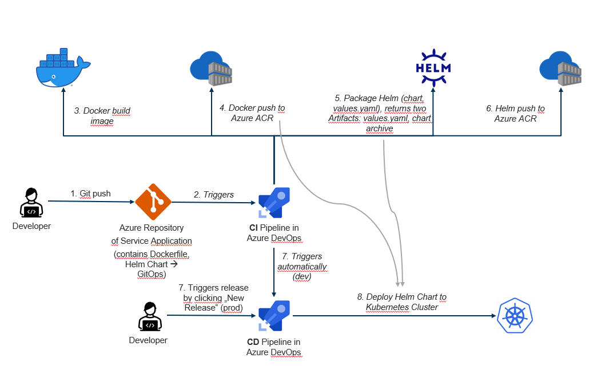

## Basic information about Pipelines in Azure DevOps

A pipeline, whether CI or CD pipeline, is always executed in the cloud on an [agent](https://docs.microsoft.com/en-us/azure/devops/pipelines/agents/agents?view=azure-devops&tabs=browser). This agent is hosted by Microsoft. In this case, we use Ubuntu 20.04 for the pipelines. Whenever a pipeline is started, a fresh VM (Docker container) is started in the cloud, which then executes the defined tasks of the pipeline. After the pipeline has been executed, the VM is deleted again. This also means that software installed during the pipeline run is deleted after the run.

Fortunately, Azure offers you the **free tier** of Azure DevOps for pipeline runs. In particular, this means that you have **1800 pipeline minutes free per month**. If the number of pipeline minutes exceeds the free number, then either another billing plan must be used or no more pipelines can run, means no more applications can be deployed. In addition, you have only one VM that can be started at a time means that only one pipeline job can be executed at a time and the other pending pipeline jobs are queued.

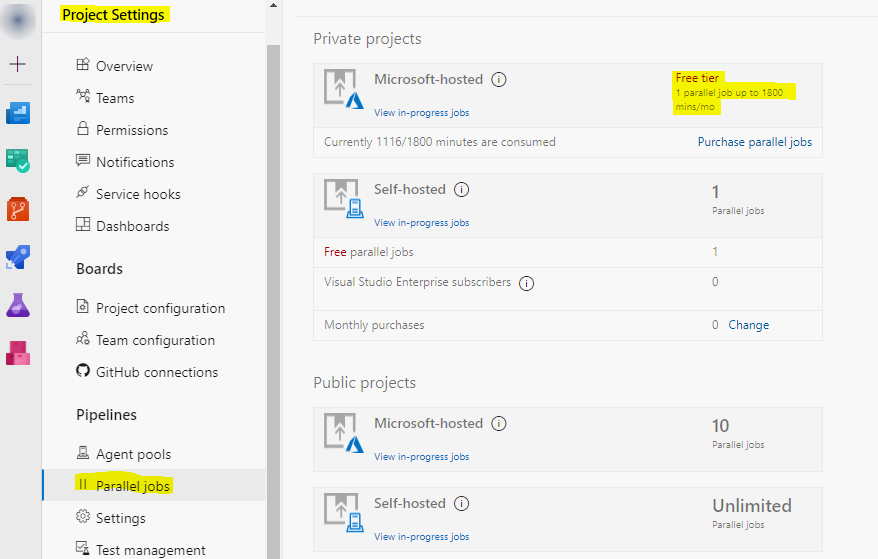

## Structure of CI Pipelines

Basically, a CI pipeline is used to build an application that can be deployed accordingly. That is, the CI pipeline can be used to build increments for applications that can be subsequently deployed from a CD pipeline. Please have a look at the template that describes a basic CI pipeline for an application (`templates/ci` folder in this repository). Every application contains a folder in its root directory called ``ci`` which contains its specification of the CI pipeline. This also means that you can adapt the CI pipeline for your needs.

In general, the CI pipeline is structured as follows. Two CI pipelines are defined for each application, one for the productive application (``pipeline-prod-temp.yaml``, main branch) and one for the test application (``pipeline-dev-temp.yaml``, test branch). However, both pipelines use the same template (``pipeline-template.yaml``) and control it via parameters (`production=true/false`). This has the advantage that a complete overview of productive/test environment is reflected in only one description of the pipeline.

In the following example we see the ``pipeline-dev-temp.yaml``, which shows the CI pipeline for the test environment. ``name`` defines the name that will be displayed later in Azure DevOps. ``$(Rev:r)`` is a predefined variable that can be used within Azure DevOps. A complete list of predefined variables within Azure DevOps is available [here](https://docs.microsoft.com/en-us/azure/devops/pipelines/build/variables?view=azure-devops&tabs=yaml). The trigger defines when exactly the CI pipeline should run. In this case, whenever a commit is made to the test branch. ``resource`` specifies which resource is used, i.e. the repository itself on which the trigger runs. ``variables`` defines which variables we want to use and with extends we use a template, which is also used by the ``pipeline-prod-temp.yaml``. This makes it easier to keep track of both pipelines and saves rewriting tasks. With ``parameters`` we give the ``pipeline-template.yaml`` the information, whether we run the pipeline for the test environment or the one for the productive environment.

```yaml
name: $(Date:yy.MM).$(Rev:r)

trigger:
- test

resources:
- repo: self

variables:
  - template: variables.yaml

extends:
  template: pipeline-template.yaml
  parameters:
      production: false
```

The pipelines are controlled by variables (``variables.yaml``). Here, basic assumptions about the application are given. For example, the name of the application is defined here (``applicationName``). The values in the section specific should be adapted accordingly to your application's need. The values in the section generic should only be adapted, if something in the cluster changes (e.g. the clusterissuer) or your application is structured differently to all other applications.

In general, the CI pipeline (``pipeline-template.yaml``) consists of 4 steps: 

  1. Build Docker image
  2. Push Docker image to ACR
  3. Build Helm ``values.yaml`` based on which pipeline is used (test/main branch) and package Helm Chart (this can also be changed and seperate values.yaml can be stored in the ci folder/helm chart)
  4. Push the Helm Chart to ACR

However, it is in no way a fixed definition but always depends on what the application requirements are. For example, a test pipeline does not always have to exist if no test environment is provided for the application. Each CI pipeline must take into account any special properties of an application, so that requirements can also be reflected in the CI pipeline. Each CI pipeline, however, requires an already working Dockerfile that can be successfully built in the Docker build step.

## Structure of CD Pipelines

In contrast to CI pipelines, CD pipelines are defined exclusively in Azure DevOps. This means, there is no folder ``cd`` in the root directory of an application but only a definition in Azure DevOps how to deploy the application. The reason for this is that according to the GitOps methodology, a deployable application has already been created by the CI pipeline and deploying an application is independent of the application itself. Azure DevOps offers the advantage that the CD pipeline does not need any yaml files at all, but the specification is easily configurable through the GUI.

The CD pipeline here consists of two stages. In the first stage, only the artifacts from the CI pipeline are output for logging purposes. In the second stage, the application is deployed to the Kubernetes cluster based on the artifacts from the CI pipeline.

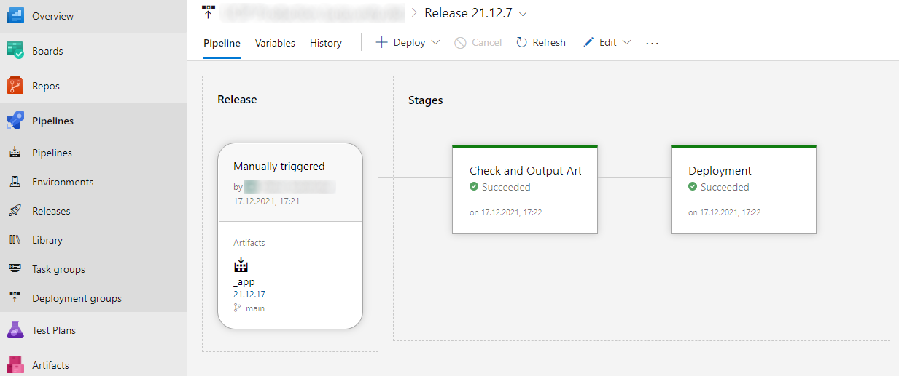

In the deployment stage of the CD pipeline, the Helm version is first installed on the agent running the CD pipeline. Because agent is a virtual machine that is started up in the cloud for the sole purpose of deployment, we are also able to install the necessary [Helm cli](https://helm.sh/docs/intro/install/). The application is then deployed using ``helm upgrade``, which includes the Helm Chart and the ``values.yaml`` file from the CI pipeline run. Whenever there is a problem with the deployment and the application cannot be rolled out, ``helm rollback`` is used to roll back to the last working release automatically. This ensures that there is always a working application running in the cluster, even if errors occur during deployment.

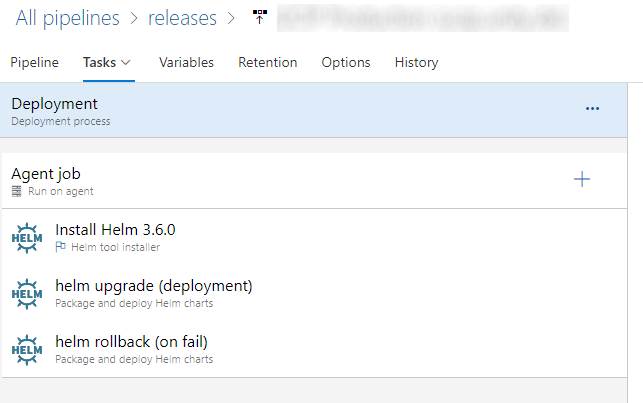

## How to deploy a Code Change to an existing Application?

This is the easiest case because the application has already been deployed successfully. In the case of the test branch, the application gets automatically deployed once the developer commits new changes. In the case of the main branch, the developer first needs to create a pull request. After the pull request has been approved, the CI pipeline runs to build a new artifact of the application. Since there are typically fixed release days, the developer needs to trigger the CD pipeline manually to create a new release and to deploy the recent artifact of the CI pipeline.

## How to deploy a completely new Application to the Kubernetes Cluster?

This section describes the procedure for deploying an application that has not yet been deployed to the Kubernetes cluster via Azure pipelines.

### Prerequisites

To deploy a new application to the Kubernetes cluster, we use the following technologies:

* [Docker](https://docs.docker.com/get-started/)
* [Helm Charts](https://helm.sh/docs/)
* [CI/CD Pipelines in Azure](https://docs.microsoft.com/en-us/azure/devops/pipelines/get-started/what-is-azure-pipelines?view=azure-devops)
* [kubectl](https://kubernetes.io/docs/reference/kubectl/overview/) and [Helm CLI](https://helm.sh/docs/intro/using_helm/) for testing purposes


In general, you should be familiar with the basic concepts of Kubernetes, especially the concepts of [Pods](https://kubernetes.io/de/docs/concepts/workloads/pods/), [Deployments](https://kubernetes.io/docs/concepts/workloads/controllers/deployment/), [Service](https://kubernetes.io/docs/concepts/services-networking/service/), [Ingress](https://kubernetes.io/docs/concepts/services-networking/ingress/) and the cli [kubectl](https://kubernetes.io/docs/reference/kubectl/overview/). You should be also familiar with [Helm Charts](https://helm.sh/). However, these are only the absolute basic requirements, of course, we encourage you to read the whole Kubernetes documentation.

### 1. Dockerize your application

To describe the deployment of a new application as close to reality as possible, we use a [Vue](https://vuejs.org/v2/guide/) application in the example, which we want to make available as a service on the Internet. The application, its Dockerfile and the CI pipelines can be found under ``templates/testapp``. The application does not have any major requirements, it just provides a [SPA](https://en.wikipedia.org/wiki/Single-page_application) based on Vue.

First of all, you need to containerize your application because Kubernetes orchestrates Docker containers. There are many templates out there, such as [nginx](https://hub.docker.com/_/nginx) to deploy a simple website, or [python](https://hub.docker.com/_/python) to run Python code in a Docker container. As a best practice, consider using the official Docker images first. You can search for them on [Dockerhub](https://hub.docker.com/). 

Once you have found a suitable image, you can build your Dockerfile based on it. For instance, this is the Dockerfile to deliver the test application containing a build stage and a production stage which keeps the image as small as possible.

```Docker
# build stage
# build stage is used to optimize Docker image size
FROM node:lts-alpine as build-stage
WORKDIR /app

# copy npm relevant files
COPY package*.json ./
# install node_modules -> dependencies
RUN npm install
# copy application files
COPY ./ .
# build application -> compiling
RUN npm run build

# production stage
FROM nginx as production-stage
RUN mkdir /app
# copy compiled JavaScript files to folder that is used by nginx for delivery
COPY --from=build-stage /app/dist /app
# set up nginx.conf file
COPY nginx.conf /etc/nginx/nginx.conf
```

Test your application such that it runs properly in the Docker container. Push the working Docker image to the Azure Container Registry (ACR). First tag your working Docker image in your local Docker repository:

```
docker tag <your local image name> <your acr name>.azurecr.io/<your organization>/<your application name>
```

If you are not logged in the ACR, follow [this tutorial](https://docs.microsoft.com/en-us/azure/container-registry/container-registry-authentication?tabs=azure-cli#individual-login-with-azure-ad). Then push your image to the ACR.

```bash
docker push <your acr name>.azurecr.io/<your organization>/<your application name>:latest
```

In the case of the test application, we'll use `<your acr name>.azurecr.io/<your organization>/testapp`. Your Docker image can now be used from anywhere, for example, in the Kubernetes cluster or in a CD pipeline.

### 2. Create a Helm Chart

Helm helps you manage Kubernetes applications — Helm Charts help you define, install, and upgrade even the most complex Kubernetes application. If you have not installed the Helm CLI yet, please follow [this tutorial](https://helm.sh/docs/intro/install/). Go to your application's root directory and create a Helm chart

```bash
helm create <your application name>
```

In the case of the test application, we use `testapp` as the application's name. A new folder is created in the root directory named by your application's name. Rename the folder to `chart`.

```bash
mv <your application name> chart
```

As a best practice, please set the following default values to the `values.yaml`.

Adapt the image information where the Docker image is located. Please also change the pullPolicy, which defines when exactly the Docker image is pulled from the ACR. This is important because we always want to get fresh Docker images from the ACR containing the latest code changes.

```yaml
image:
  repository: <your acr name>.azurecr.io/<your organization>/<your application name>
  pullPolicy: Always
  # Overrides the image tag whose default is the chart appVersion.
  tag: "latest"
```

The ingress resource is used to define how traffic from outside is routed to your application. The most important parts are `annotations`, `hosts` and `tls`. With `annotations` we can define that our application should have additional properties. For example, our application should provide valid TLS certificates to encrypt every connection.  With `cert-manager.io/cluster-issuer: 'letsencrypt-clusterissuer'`, the Kubernetes service will ask the `letsencrypt-clusterissuer` for a valid TLS certificate and injects it automatically to the ingress resource. So we don't have to worry about TLS certificates anymore, everything happens automatically in the background only be defining this annoation. Please also be aware that only the Ingress resource holds and uses the TLS certificates, but the communication from the Ingress resource to your application is unencrypted (communication inside the cluster). This means no TLS certificate needs to be used in your application. So your application does not even know that it supports TLS encryption to the outside world.

With the following two annoations `nginx.ingress.kubernetes.io/auth-signin` and `nginx.ingress.kubernetes.io/auth-url` we define that the OAuth2 proxy is placed in front of the application. Thus, it is necessary to authenticate with the Microsoft Identity Provider beforehand to be able to use the application. This has the advantage that only authenticated users can see your application, so that even business logic within an SPA is secured and not leaked to the internet. We use different OAuth2 proxies for the test environment (development namespace, dev.<your application name>.xxx.de) and production environment (production namespace, <your application name>.xxx.de). In this case, we specify the ingress resource for the test tenant such that the application can be deployed to the development namespace. Later on, the ingress resource is defined by the CI pipeline (production pipeline -> production ingress resource, development pipeline -> development ingress resource).

```yaml
ingress:
  fullname: "<your application name>"
  enabled: true
  annotations:
    kubernetes.io/ingress.class: "nginx"  
    cert-manager.io/cluster-issuer: 'letsencrypt-clusterissuer' # different in prod environment
    nginx.ingress.kubernetes.io/auth-signin: https://dev.auth.xxx.de/oauth2/start?rd=https%3A%2F%2Fdev.<your application name>.xxx.de # different in prod environment
    nginx.ingress.kubernetes.io/auth-url: https://dev.auth.xxx.de/oauth2/auth # different in prod environment
  hosts:
  - host: dev.<your application name>.xxx.de
    paths:
      - path: /
        pathType: Prefix
  tls:
    - hosts: 
      - dev.<your application name>.xxx.de  # different in prod environment
      secretName: <your application name>-dev-cert  # different in prod environment
```

In the resource section we describe what maximum resources the application may have. For a simple Vue application this is only a few hundred megabytes and little CPU, because the service only has to return the requested files. For Python applications, for example, more resources may be needed, since Python performs server-side operations.

```yaml
resources: 
  cpu: <cpu>m # e.g. 100m
  memory: <memory>Mi # e.g. 128Mi
requests:
  cpu: <cpu>m # e.g. 100m
  memory: <memory>Mi # e.g. 128Mi
```

Please be aware that for special requirements it may also be necessary to customize the templates under `chart/templates` using the Go programming language. This is the case, for example, when the data must be stored persistently. This is especially the case when we use databases. After a restart of the pod, the data must not be lost but must be re-integrated into the pod. [PVCs (Persistant Volume Claims)](https://docs.microsoft.com/en-us/azure/aks/azure-disks-dynamic-pv) are used within Kubernetes for this purpose. Be aware that every PVC requested and included in Azure costs money, even if it's just a few dollars. Whenever a PVC is requested by Azure, the disks are visible in the Kubernetes cluster resource group and in the cost summary. An example for PVC included in a Helm Chart can be found in `templates/pvc`.

To test your application, just deploy your application to the Kubernetes cluster's development namespace manually.

```
helm upgrade --install --wait --debug -n development <your application name>-dev ./chart
```

Your application should now be deployed and accessible from the Internet via https://dev.\<your application name\>.xxx.de.

You can check your [Helm release](https://helm.sh/docs/glossary/#release) with

```
helm list --all-namespaces
```

Please uninstall your application again with

```
helm uninstall <your application name>-dev -n development
```

All your application's Kubernetes resources are deleted now.

### 3. Create a CI Pipeline

Now that we know that the application can be installed inside the Kubernetes cluster using Helm and is running properly, we can get down to preparing for automated deployment. 

To do this, we first prepare the [CI pipelines](https://docs.microsoft.com/en-us/azure/architecture/example-scenario/apps/devops-dotnet-webapp), which are structured as follows (see chapter [Structure of CI Pipelines](#structure-of-ci-pipelines)):

  1. Build Docker image
  2. Push Docker image to ACR
  3. Build Helm ``values.yaml`` based on which pipeline is used (test/main branch) and package Helm Chart
  4. Push the Helm Chart to ACR

Before continue performing this step, please read the information about CI pipelines in chapter [Structure of CI Pipelines](#structure-of-ci-pipelines) that give you basic knowledge about the structure.

In the following example, we will use the template under `templates/ci` as a guide.

We first customize the ``variables.yaml`` that holds basic information about the CI pipeline operation. Here we first adjust the ``applicationName``, which is used, among other things, for the URL under which the application is later accessible (see ``pipeline-template.yaml``). If further variables are necessary for the application (e.g. multiple URLs, environment variables etc.), then the ``variables.yaml`` can be filled with variables so that these can be inserted when building the ``values.yaml`` (taking into account that the Helm Chart also accepts and considers the set values). 

**In general, an application is always developed in an environment-independent manner, i.e. the application can be configured externally so that it can be executed in a specific environment. The CI pipeline then prepares the application so that it can be executed in a specific environment (development, environment).**

In the case of our test application example (``templates/testapp``), we don't need to make any other changes except to adjust variables.yaml.

```yaml
variables:
  ##################
  #### SPECIFIC ####
  ##################

  # please put your application name here
  applicationName: '<your application name>'

  # please put the URL here where you application should be accessible
  hostname: '<your application>.xxx.de'
```

We can now create the CI pipelines in Azure DevOps based on our CI folder:

1. Push your changes to the main branch
2. If not already done, create a branch that is called test (consider the Git Workflow) which also contains the ci folder

To create the production CI pipeline, follow these steps:
   1. Go to `https://dev.azure.com/<your organization>`
   2. Click on Pipelines, all CI piplines from all applications are displayed here
   3. Click on "New pipeline"
   4. Select "Azure Repos Git"
   5. Select the application's repository
   6. Select "Existing Azure Pipelines YAML File" because we already have defined the pipelines in the ci folder
   7. Select main branch and the production pipeline yaml `pipeline-prod-temp.yaml` 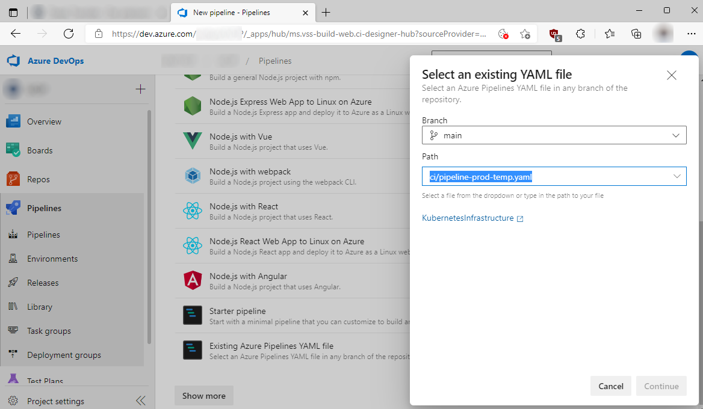
   8. Click on "Continue" and save the pipline 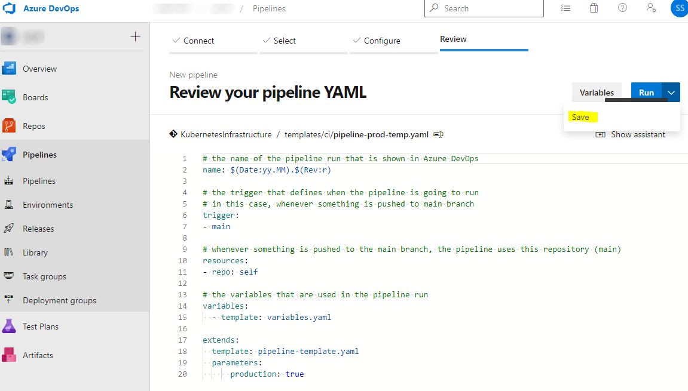   
   9. Rename the pipeline to a proper name

Repeat the steps for the test CI pipeline which builds your application for the test environment. Here, select `pipeline-dev-temp.yaml`.

Please run now the CI pipelines manually. Select the right branch for the respective CI pipeline. In the case of the first run, you need to permit permissions to the pipeline s.t. it is allowed to push the files (Docker image and Helm Chart) to the ACR. The pipelines use [service connections](https://docs.microsoft.com/en-us/azure/devops/pipelines/library/service-endpoints?view=azure-devops&tabs=yaml) that allow them to access resources from Azure.

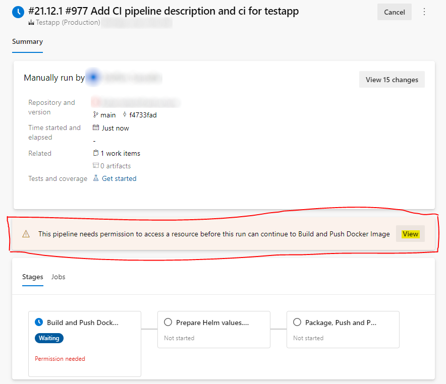

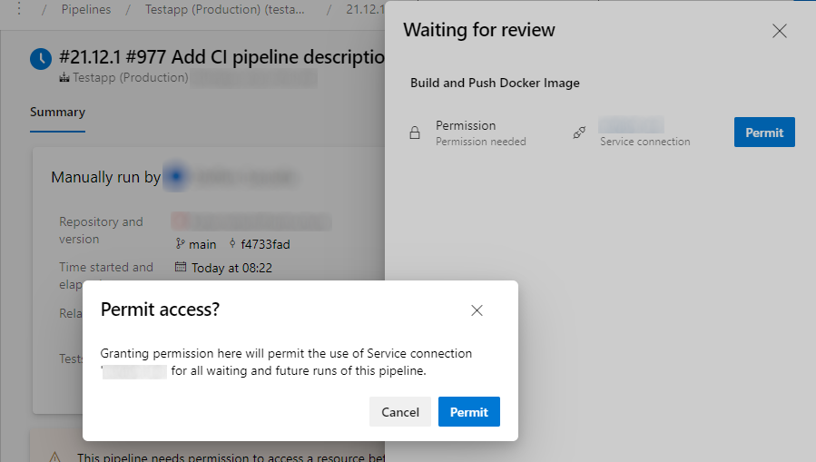

The pipeline now builds your artifacts based on the pipeline description in the yaml files of the ci folder.

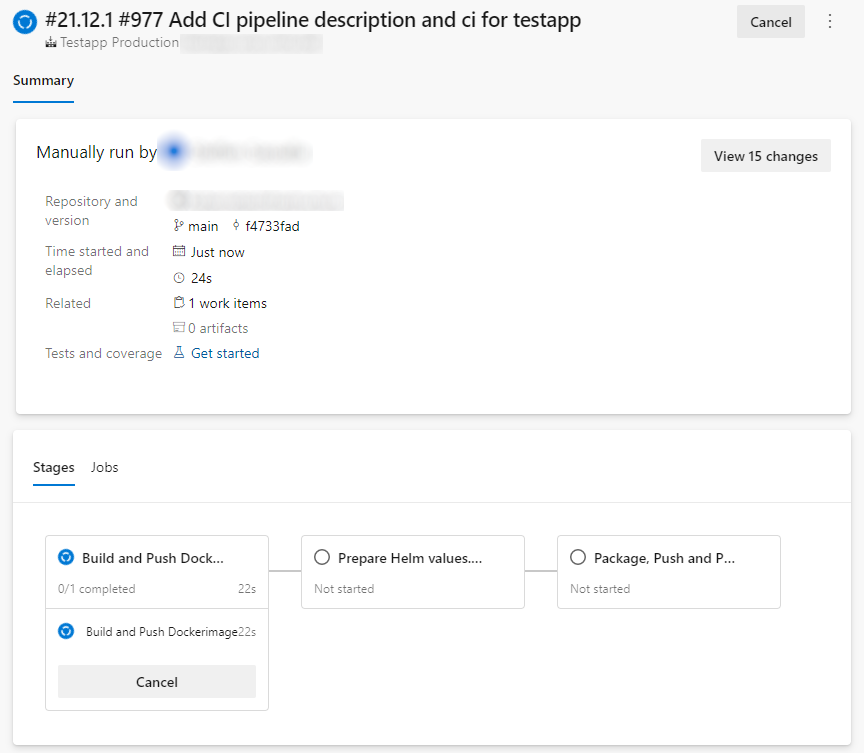

When the pipeline has been successfully run, the artifacts can be viewed, which are later viewed from the CD pipeline. These artifacts correspond to an application specific to an environment (development, production).

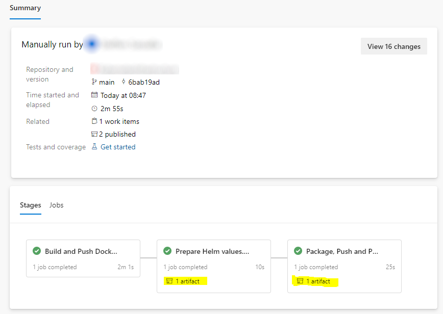

The CI pipeline creates two artifacts: The Helm Chart archive ``chart.tgz`` and the ``values.yaml``, which contains the environment dependencies. The Docker image is automatically downloaded from the ACR during deployment, since the Docker image and the corresponding tag are defined in ``values.yaml``. You can also download the artifacts to deploy them with Helm CLI manually.

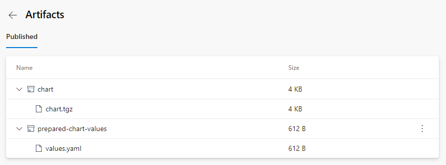

### 4. Create a CD Pipeline

Now that we have created executable artifacts through the CI pipeline, we can deploy the application using a [CD pipeline](https://docs.microsoft.com/en-us/azure/architecture/example-scenario/apps/devops-dotnet-webapp), which is also called release pipeline in Azure DevOps.
The CD pipeline, unlike the CI pipeline, is defined exclusively in Azure DevOps via the GUI and not via yaml files in the repository.

To create a CD pipeline in DevOps, do the following:

   1. Open `https://dev.azure.com/<your organization>`
   2. Click on "Releases", here you see all CD Pipelines for every application (one for test environment, one for production)
   3. Select an existing production pipeline and clone it 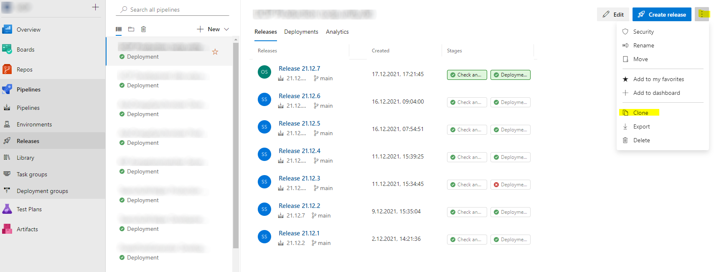
   4. Rename the pipeline and click on save 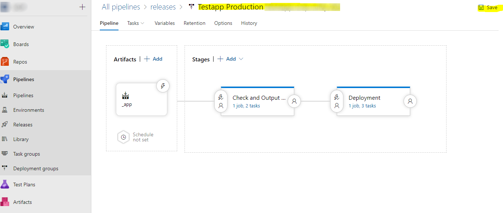
   5. Select the artifact and delete it  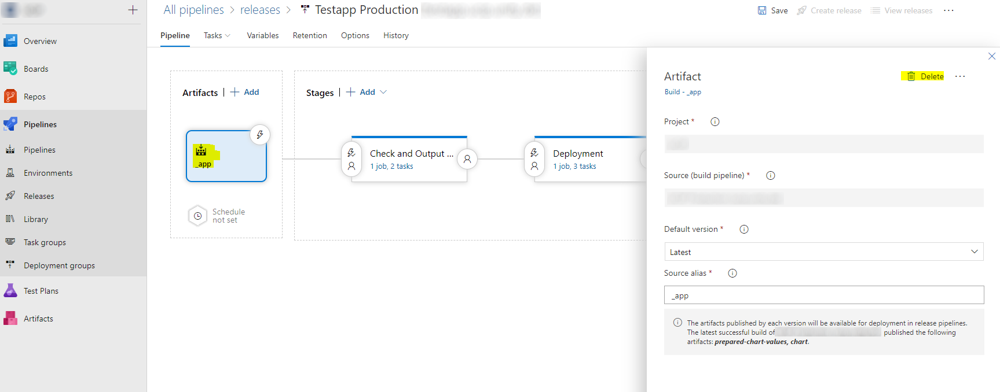
   6. Click on "Add artifact", select the proper source build pipeline (CI pipeline) of the application and rename the source alias to ``_app``, click on add to add the artifact. Consider to set a trigger for the CD pipeline that deploys the test application (test branch) to make sure a deployment is triggered everytime a CI pipeline creates an artifact. Thus, with every commit on the test branch, the application gets rebuilt and deployed. The trigger icon is located above the artifact square and is represented as a lightning bolt. 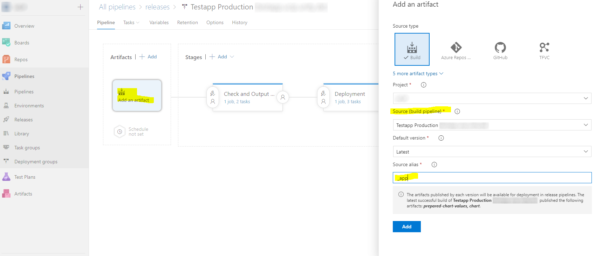
   7. Select the Deployment stage and rename the release name to `<your application name>-prod` 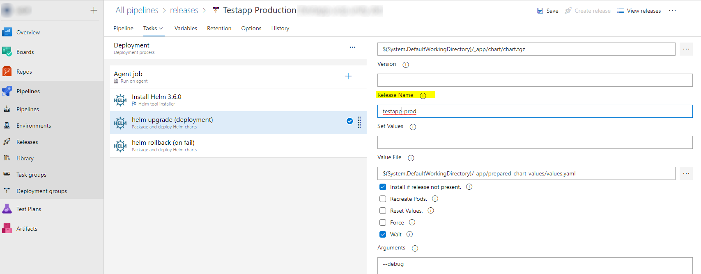
   8. Do the same for the rollback task 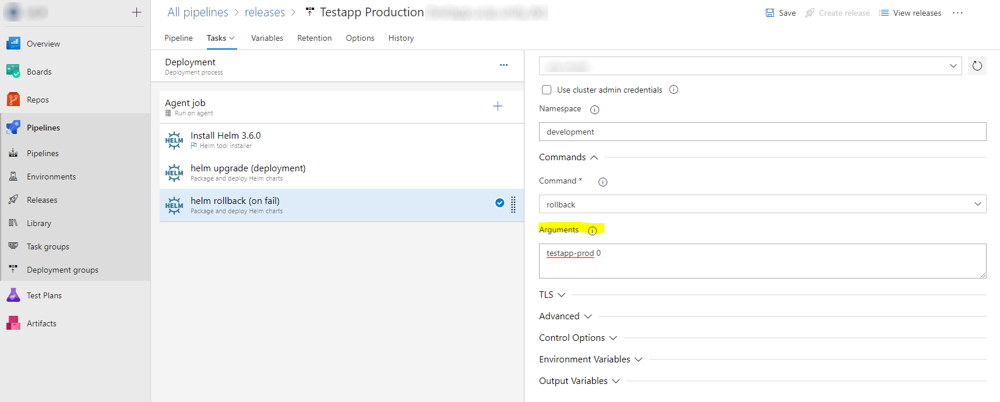
   9. Save the pipeline and click on "Create release" to deploy your application to the Kubernetes Cluster automatically 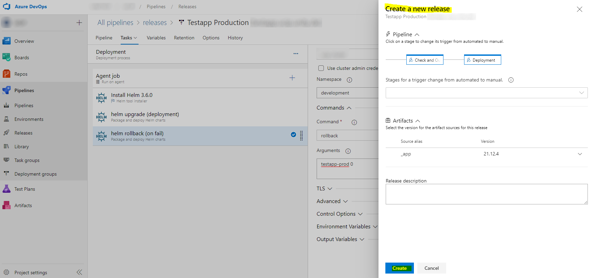

Repeat the steps for the CD pipeline that deploys the test application. To do this, you can simply clone a CD pipeline that rolls out a test application (e.g. Testapp Development).

After creating a release, the pipeline will take the last artifact from the CI pipeline and then deploys the application to the cluster with ``helm upgrade``. If an error occurs, the next step in the pipeline is to roll back to the last working version. In this way, applications always remain accessible in the cluster, even if the deployment did not work.

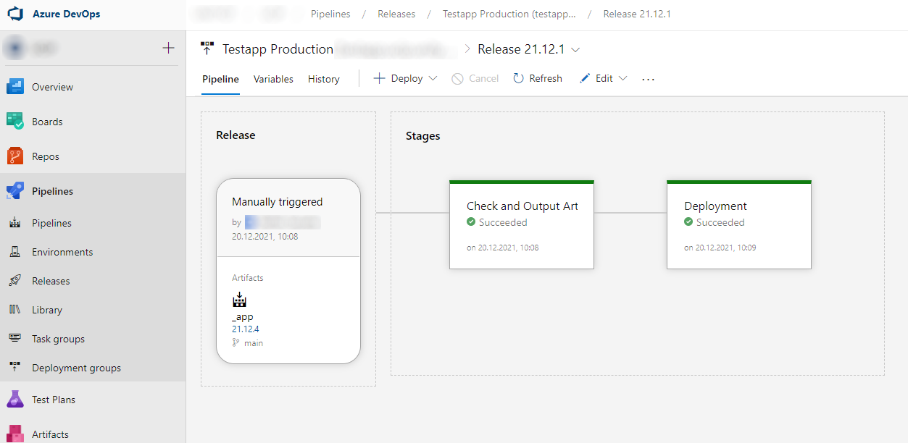

When the CD pipeline has successfully run, the application is accessible at the URL defined in the Ingress resource. In the case of the test application, this is https://testapp.xxx.de. It may take a few minutes to obtain a valid TLS certificate from Let's Encrypt.

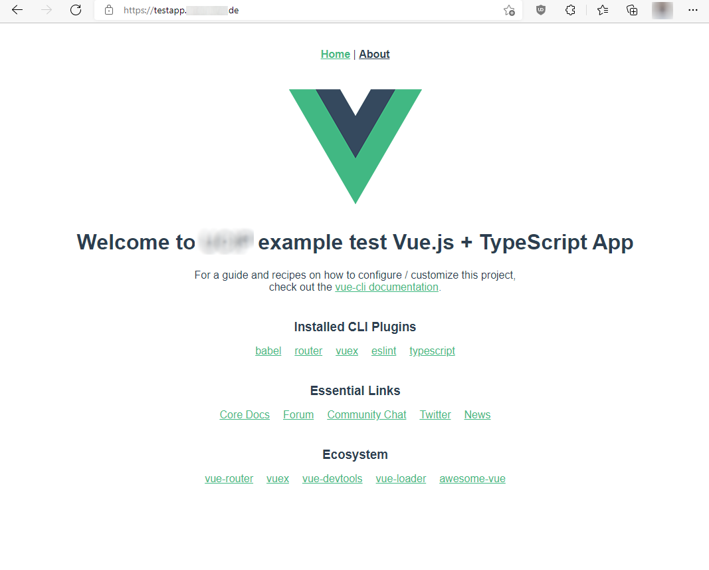